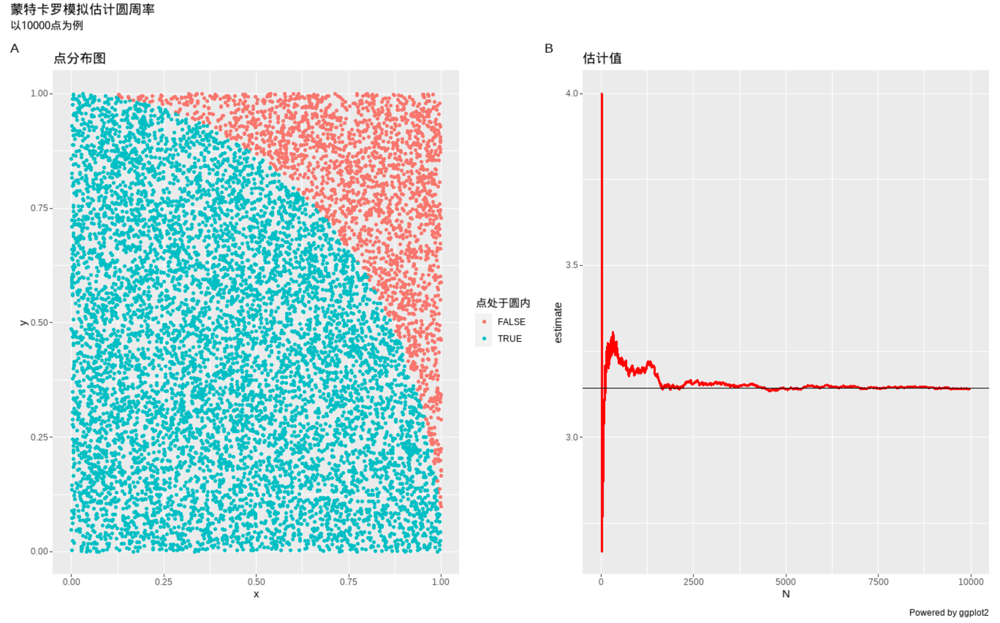

# Note:

penguins_classification.R 为企鹅种类预测代码  
monte_carlo_method.R 为蒙特卡罗方法预测圆周率代码

# 蒙特卡洛模拟



最后5行数据如下

| **N**  **<int>** | **x**  **<dbl>** | **y**  **<dbl>** | **inside**  **<dbl>** | **estimate**  **<dbl>** |
| --------         | ---------------- | ---------------- | --------------------- | ----------------------- |
| *9996*           | 0.76050997       | 0.4771775        | 1                     | 3.140456                |
| *9997*           | 0.62543233       | 0.7649952        | 1                     | 3.140542                |
| *9998*           | 0.87256512       | 0.5652930        | 0                     | 3.140228                |
| *9999*           | 0.61448369       | 0.8442038        | 0                     | 3.139914                |
| *10000*          | 0.02698771       | 0.8848038        | 1                     | 3.140000                |

-------

# 企鹅种类预测模型

## 模型目的

根据企鹅数据集中企鹅吻的长度和深度进行建模来预测企鹅种类

## 数据来源

数据操作基于tidyverse  
模型构建基于tidymodels

数据来源如下, 也可直接使用同目录下的数据文件

```{r}
install.packages("palmerpenguins")
library(palmerpenguins)
```

## 字段含义

|variable          |class   |description
|:---:             |:---:   |:--:
|species           |factor  |企鹅种类(Adelie, Gentoo, Chinstrap)
|island            |factor  |所在岛屿(Biscoe, Dream, Torgersen)
|bill_length_mm    |double  |嘴峰长度(单位毫米)
|bill_depth_mm     |double  |嘴峰深度(单位毫米)
|flipper_length_mm |integer |鰭肢长度(单位毫米)
|body_mass_g       |integer |体重 (单位克)
|sex               |factor  |性别
|year              |integer |记录年份

## 数据清洗

性别缺失值较多, 且本例不需性别字段, 直接删去此字段
```{r}
species island bill_length_mm bill_depth_mm flipper_length_mm body_mass_g    sex  year
    <dbl>  <dbl>          <dbl>         <dbl>             <dbl>       <dbl>  <dbl> <dbl>
1       0      0        0.00581       0.00581           0.00581     0.00581 0.0320     0
```

余下数据缺失值占比较小, 均不超过0.6%, 故直接删去缺失的观测

```{r}
species island bill_length_mm bill_depth_mm flipper_length_mm body_mass_g  year
    <dbl>  <dbl>          <dbl>         <dbl>             <dbl>       <dbl> <dbl>
1       0      0        0.00581       0.00581           0.00581     0.00581     0
```

所余有效数据共342例, 按0.75比率划分数据集, 得到训练集257例, 测试集85例

## 预测结果

```{r}
> result
$result_log
# A tibble: 5 x 3
  预测值 真实值        n
  <fct>  <fct>     <int>
1 Adelie Adelie       35
2 Adelie Chinstrap     3
3 Gentoo Adelie        1
4 Gentoo Gentoo       26
5 Gentoo Chinstrap    20

$result_neighbor
# A tibble: 7 x 3
  预测值    真实值        n
  <fct>     <fct>     <int>
1 Adelie    Adelie       35
2 Adelie    Chinstrap     4
3 Gentoo    Gentoo       25
4 Gentoo    Chinstrap     1
5 Chinstrap Adelie        1
6 Chinstrap Gentoo        1
7 Chinstrap Chinstrap    18

$result_multinom
# A tibble: 6 x 3
  预测值    真实值        n
  <fct>     <fct>     <int>
1 Adelie    Adelie       35
2 Adelie    Chinstrap     3
3 Gentoo    Gentoo       26
4 Gentoo    Chinstrap     1
5 Chinstrap Adelie        1
6 Chinstrap Chinstrap    19

$result_decision
# A tibble: 7 x 3
  预测值    真实值        n
  <fct>     <fct>     <int>
1 Adelie    Adelie       29
2 Adelie    Chinstrap     2
3 Gentoo    Adelie        3
4 Gentoo    Gentoo       23
5 Chinstrap Adelie        4
6 Chinstrap Gentoo        3
7 Chinstrap Chinstrap    21

$result_randomForest
# A tibble: 7 x 3
  预测值    真实值        n
  <fct>     <fct>     <int>
1 Adelie    Adelie       33
2 Adelie    Chinstrap     2
3 Gentoo    Gentoo       25
4 Gentoo    Chinstrap     1
5 Chinstrap Adelie        3
6 Chinstrap Gentoo        1
7 Chinstrap Chinstrap    20
```
